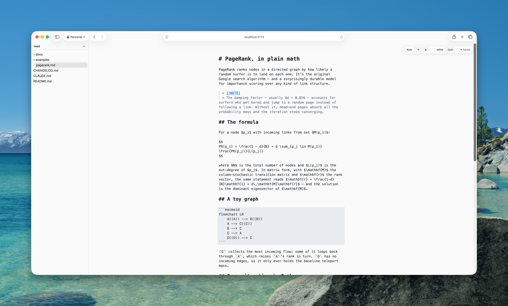
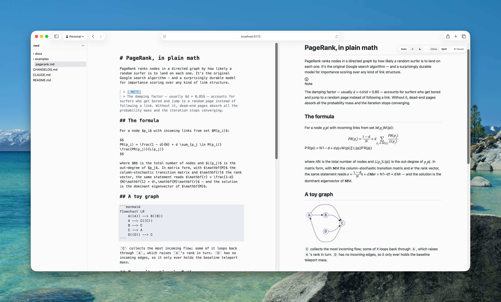

# reed

A local markdown editor served in your browser. Launch it from the CLI against a directory or a single `.md` file, and it opens an editor in your default browser. The preview renders GFM (tables, strikethrough, task lists), KaTeX math, Mermaid diagrams, footnotes, GitHub-style alerts, and syntax-highlighted code. Edits autosave; external changes propagate via SSE.





## Why does this exist?

Sometimes I need a quick edit or preview on a markdown file. I may not want to open VS Code or Obsidian. This came from that. This is not meant to be an alternative to any of the more robust markdown editors. This is not even the only one I use. It's just a convenient tool to have, no extra dependencies or apps to install. Just run it, make your edits, and close it out.

## Install

```bash
brew tap adamtootle/reed
brew install reed
```

## Usage

```bash
reed                # current directory in directory mode
reed ~/notes        # specific directory
reed notes.md       # single-file mode (no sidebar)
reed --port 9000 .  # pin to a specific port
```

The release binary defaults to an OS-assigned port. Pass `--port <n>` to pin one.

## Development

```bash
swift run dev               # current directory
swift run dev ~/notes       # specific directory
```

`swift run dev` spawns the Swift backend on `:8765` and the Vite dev server on `:5173` in one foregrounded process, prefixes their output (`[reed]` / `[vite]`), opens the Vite URL in your browser once it's ready, and tears both children down on Ctrl+C. The first run installs frontend deps via `npm install` if `frontend/node_modules` is missing.

The Vite dev server proxies `/api/*`, `/events`, and non-asset paths to the Swift backend, so HMR works on the frontend while the backend serves data.

If you'd rather run the two servers separately:

```bash
# Terminal 1 — Swift backend (DEBUG builds default to port 8765)
swift run reed --port 8765 ~/path/to/notes

# Terminal 2 — Vite dev server
cd frontend && npm install && npm run dev
```

### Test suites

```bash
# Frontend (Vitest + happy-dom)
cd frontend && npm test

# Backend (XCTest)
swift test
```

## Production build

```bash
cd frontend && npm ci && npm run build
swift build -c release
.build/release/reed ~/path/to/notes
```

`npm run build` emits the bundled assets into `Sources/reed/Resources/` (gitignored). `swift build -c release` packages them into the binary via `Bundle.module`.

## Architecture

- **Backend** — Swift 6.2, [Hummingbird](https://github.com/hummingbird-project/hummingbird) 2, ArgumentParser. Serves `/api/config`, `/api/files`, `/api/file` (GET/PUT), `/events` (SSE), and `/**` (static asset wildcard).
- **Frontend** — Vite + TypeScript + Tailwind v4 + vanilla TS. CodeMirror 6 with a custom decoration plugin for the inline ("Mode A") view, markdown-it pipeline for the rendered preview ("Mode B"), with KaTeX, GitHub-style alerts, footnotes, GFM tables/strike/task-lists, and lazy-loaded Mermaid.

See [`docs/architecture.md`](docs/architecture.md) for the full design.
