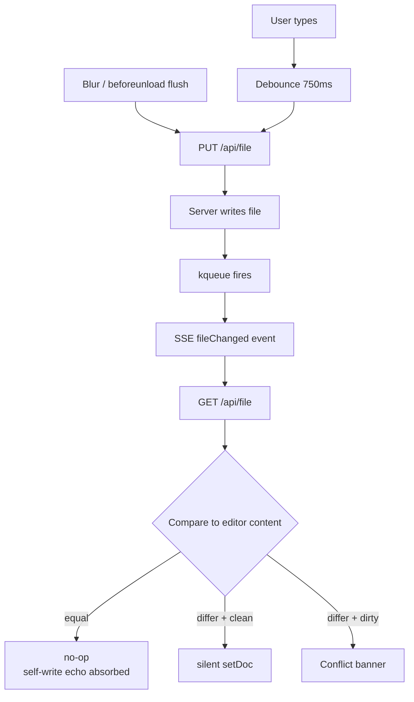
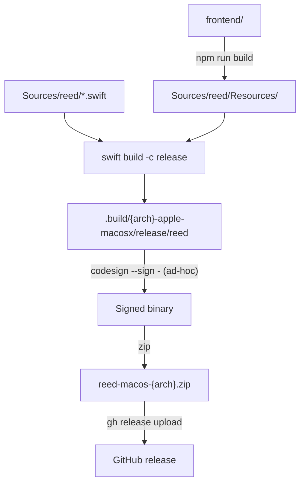

# reed — Architecture

reed is a single-binary local markdown editor for macOS. The user runs `reed ~/notes` (or `reed some-file.md`), reed binds an HTTP server, opens the default browser, and serves a Vite-built UI that reads and writes the user's markdown files. Production is one Swift binary with the frontend bundled in.

For design rationale, see [`docs/specs/backend.md`](specs/backend.md) and [`docs/specs/frontend.md`](specs/frontend.md). For commands and gotchas, see [`CLAUDE.md`](../CLAUDE.md). For releases and installation, see [`docs/publishing.md`](publishing.md).

## System shape

```
┌──────────────────────────────────────────────┐
│  reed (single binary)                        │
│                                              │
│  ┌─────────────────────────────────────────┐ │
│  │  Swift backend (Hummingbird 2)          │ │
│  │  ─ /api/config, /api/files, /api/file   │ │
│  │  ─ /events  (SSE)                       │ │
│  │  ─ /**      (wildcard static)           │ │
│  │  ─ FileWatcher  (kqueue, .md only)      │ │
│  │  ─ SSEBroadcaster  (actor)              │ │
│  └─────────────────────────────────────────┘ │
│                     ▲                        │
│  ┌──────────────────┴──────────────────────┐ │
│  │  Bundle.module → Resources/             │ │
│  │  index.html + assets/ (Vite build)      │ │
│  └─────────────────────────────────────────┘ │
└──────────────────────┬───────────────────────┘
                       │ HTTP / SSE
                       ▼
              ┌──────────────────┐
              │  Default browser │
              │  Vanilla TS UI   │
              └──────────────────┘
```

Browser and backend run on the same origin in production (Swift serves both); in dev, Vite serves the frontend on `:5173` and proxies `/api` and `/events` to Swift on `:8765`.

## Backend (`Sources/reed/`)

Swift 6.2, Hummingbird 2, ArgumentParser. macOS-only — `main.swift` imports `Darwin` (kqueue/dispatch sources) and `Server.swift` imports `AppKit` (`NSWorkspace.shared.open`).

| File | Responsibility |
|---|---|
| `main.swift` | CLI entry, port resolution, input-mode detection (directory vs single-file) |
| `Server.swift` | Hummingbird router (registers all routes; handles `/` and `/api/config` inline), browser launch |
| `FileAPI.swift` | `/api/files`, `/api/file` GET/PUT |
| `FileTree.swift` | Recursive `.md` tree with depth/count cap, gitignore filtering |
| `GitIgnore.swift` | Pattern → regex conversion, ordered rule application |
| `FileWatcher.swift` | kqueue-based recursive watcher; mod-time snapshot diffs |
| `SSE.swift` | `SSEBroadcaster` actor; `event: fileChanged` to all clients |
| `PathValidator.swift` | Pure-path traversal check (no symlink resolution) |

**Routing**: explicit routes first, then `/**` wildcard last so it only catches what the explicit routes don't (used for image references in preview).

**Path safety**: `PathValidator` uses `URL.standardized` (pure, no disk I/O). Symlinks pointing outside root aren't blocked by the validator — `FileTree` skips symlinks during traversal so they can't be discovered through `/api/files`, and `FileAPI` further restricts reads/writes to `.md` (or `README.*`) files.

**SSE concurrency**: `SSEBroadcaster` is a Swift `actor` — required for Swift 6.2 strict concurrency. The watcher fires a callback that the actor serializes across all connected clients.

## Frontend (`frontend/src/`)

Vite + TypeScript + Tailwind v4 + CodeMirror 6 + markdown-it. No framework — vanilla TS with focused modules. Tested with Vitest + happy-dom.

| Module | Responsibility |
|---|---|
| `main.ts` | Boot sequence, wires store + editor + tree + SSE + autosave |
| `state/` | `AppState`, pub/sub `store`, `saveStateMachine`, `debounce` |
| `api/` | Typed REST client, SSE client with exponential backoff |
| `editor/` | CodeMirror setup, decoration plugin, markdown keymap, mode swap |
| `preview/` | markdown-it pipeline, lazy-loaded Mermaid, scroll sync |
| `ui/` | `pill`, `fileTree`, `splitter`, `conflictBanner`, `sidebarCollapse`, `emptyState` |
| `theme/` | `prefers-color-scheme` + manual override (auto/light/dark) |
| `styles/` | Single Tailwind v4 entry; all widget CSS lives here |

**Two view modes**, controlled by the floating pill:

- **Inline** — single CodeMirror pane with proportional font and live decorations applied via a `ViewPlugin` walking the Lezer tree. Markers stay visible alongside styling. The default "writing" mode.
- **Split** — editor on the left (monospace, decorations disabled), markdown-it preview on the right, bidirectional scroll-synced.

Two `Compartment`s in the CodeMirror state let `applyMode()` swap the decoration plugin and font theme without rebuilding the editor.

**Mermaid** is lazy-loaded — `import('mermaid')` only fires when a document actually contains a `mermaid` fenced block. Rendered SVG is memoized by source string so repeat renders are free.

## Save & sync flow

The non-obvious part of the system. Three independent triggers can write to disk; one SSE listener decides what to do with anything that comes back.



Key invariants:
- After any `editor.setDoc(...)`, **always call `saveDebouncer.cancel()`** to prevent an echo-save of programmatically-set content.
- `beforeunload` flush uses `fetch(..., { keepalive: true })`, capped at 64KB by the browser — that's why regular saves use plain `fetch`.
- SSE reconnect re-fetches `/api/files` and reconciles the current file, catching up on anything missed during the outage.

## State and persistence

Zero UI-state persistence by design. Theme override, view mode, sidebar collapse state, splitter ratio, file-tree expand state all reset on reload. The reasoning: in release builds the port is OS-assigned, so each launch is a different origin — `localStorage` wouldn't survive anyway. Persistence requires reconsidering that choice, not adding `localStorage` ad-hoc.

## Build and distribution



The flow runs twice in parallel on CI — once for `arm64` and once for `x86_64`.

`Sources/reed/Resources/` is gitignored — populated by `npm run build` in dev and CI; bundled into the binary via `Package.swift`'s `.copy("Resources")`. The release pipeline builds an arm64 zip and an x86_64 zip (cross-compiled on the arm64 runner) and uploads both to the GitHub release; see [`publishing.md`](publishing.md).

