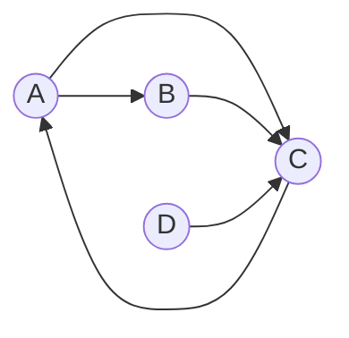

# PageRank, in plain math

PageRank ranks nodes in a directed graph by how likely a random surfer is to land on each one. It's the original Google search algorithm — and a surprisingly durable model for importance scoring over any kind of link structure.

> [!NOTE]
> The damping factor — usually $d = 0.85$ — accounts for surfers who get bored and jump to a random page instead of following a link. Without it, dead-end pages absorb all the probability mass and the iteration stops converging.

## The formula

For a node $p_i$ with incoming links from set $M(p_i)$:

$$
PR(p_i) = \frac{1 - d}{N} + d \sum_{p_j \in M(p_i)} \frac{PR(p_j)}{L(p_j)}
$$

where $N$ is the total number of nodes and $L(p_j)$ is the out-degree of $p_j$. In matrix form, with $\mathbf{M}$ the column-stochastic transition matrix and $\mathbf{r}$ the rank vector, the same statement reads $\mathbf{r} = \frac{1-d}{N}\mathbf{1} + d\,\mathbf{M}\mathbf{r}$ — and the solution is the dominant eigenvector of $\mathbf{M}$.

## A toy graph



`C` collects the most incoming flow; some of it loops back through `A`, which raises `A`'s rank in turn. `D` has no incoming edges, so it only ever holds the baseline teleport mass.

## Power iteration in Python

```python
import numpy as np

def pagerank(M, d=0.85, tol=1e-8, max_iter=100):
    N = M.shape[0]
    r = np.ones(N) / N
    teleport = (1 - d) / N
    for _ in range(max_iter):
        r_next = teleport + d * (M @ r)
        if np.linalg.norm(r_next - r, ord=1) < tol:
            return r_next
        r = r_next
    return r
```

`M` must be column-stochastic — every column sums to 1 — or the iteration drifts off the probability simplex and the result stops being a distribution.

## How it compares

| Metric        | Direction | Source weight |
| ------------- | :-------: | :-----------: |
| In-degree     |     ✓     |       ✗       |
| Eigenvector   |     ✓     |       ✓       |
| **PageRank**  |   **✓**   |     **✓**     |

In-degree treats every incoming link equally; PageRank recognizes that a link from an already-important page should count for more than one from a random source.

## To explore

- [ ] Re-derive the damping factor from a continuous-time random walk
- [ ] Implement personalized PageRank with a non-uniform teleport vector
- [x] Read the original Brin & Page paper[^1]

[^1]: Brin, S., & Page, L. (1998). *The Anatomy of a Large-Scale Hypertextual Web Search Engine*. Stanford Digital Libraries Project.
